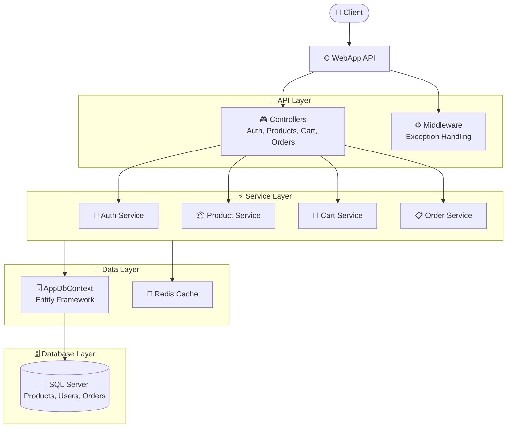

# WebApp API

<div align="center">

A comprehensive e-commerce Web API built with ASP.NET Core, featuring product management, user authentication, shopping cart, and order processing capabilities.

[](https://dotnet.microsoft.com/)
[](LICENSE)

</div>

## 📋 Table of Contents

- [Features](#-features)
- [Technologies](#-technologies)
- [Prerequisites](#-prerequisites)
- [Configuration](#-configuration)
- [Getting Started](#-getting-started)
- [API Endpoints](#-api-endpoints)
- [Architecture](#-architecture)
- [Project Structure](#-project-structure)
- [Security](#-security)
- [Database Models](#-database-models)
- [Testing](#-testing)
- [License](#-license)

## 🚀 Features

- **Product Management**: CRUD operations for products with filtering and pagination
- **User Authentication**: JWT-based authentication with registration and login
- **Shopping Cart**: Add, update, and remove items from cart
- **Order Processing**: Checkout functionality and order management
- **Caching**: Redis-based caching for improved performance
- **API Documentation**: Swagger/OpenAPI integration
- **Validation**: FluentValidation for request validation
- **Logging**: Serilog for structured logging

## 🛠️ Technologies

| Technology | Version | Purpose |
|------------|---------|---------|
| ASP.NET Core | 10.0 | Web framework |
| SQL Server | Latest | Database |
| Entity Framework Core | 10.0.9 | ORM |
| Redis | Latest | Caching |
| AutoMapper | 12.0.0 | Object mapping |
| FluentValidation | 11.3.1 | Input validation |
| Serilog | 6.x | Logging |
| Swashbuckle.AspNetCore | 10.2.3 | Swagger/OpenAPI |

## 📋 Prerequisites

- [.NET 10.0 SDK](https://dotnet.microsoft.com/download)
- [SQL Server](https://www.microsoft.com/sql-server) (LocalDB for development)
- [Redis Server](https://redis.io/download) (for caching)

## 🔧 Configuration

### Connection Strings

Update the connection string in `appsettings.json`:

```json
{
  "ConnectionStrings": {
    "DefaultConnection": "Server=(localdb)\\mssqllocaldb;Database=WebApp;Trusted_Connection=True;MultipleActiveResultSets=True;"
  }
}
```

### JWT Settings

Configure JWT settings in `appsettings.json`:

```json
{
  "Jwt": {
    "Key": "YOUR_SECRET_KEY",
    "Issuer": "WebApp",
    "Audience": "WebAppUsers",
    "ExpiresInMinutes": 60
  }
}
```

## 🚀 Getting Started

### 1. Clone the Repository

```bash
git clone <repository-url>
cd WebApp.Api
```

### 2. Restore Dependencies

```bash
dotnet restore
```

### 3. Update Database

```bash
dotnet ef database update
```

### 4. Run the Application

```bash
dotnet run
```

The API will be available at `https://localhost:7000` (or the configured port).

## 📚 API Endpoints

### Authentication

| Method | Endpoint | Description |
|--------|----------|-------------|
| POST | `/api/auth/register` | Register a new user |
| POST | `/api/auth/login` | Login and receive JWT token |

### Products

| Method | Endpoint | Description |
|--------|----------|-------------|
| GET | `/api/products` | Get all products (with pagination) |
| GET | `/api/products/{id}` | Get product by ID |
| POST | `/api/products` | Create a new product |
| PUT | `/api/products/{id}` | Update a product |
| DELETE | `/api/products/{id}` | Delete a product |

### Cart

| Method | Endpoint | Description |
|--------|----------|-------------|
| GET | `/api/cart` | Get current user's cart |
| POST | `/api/cart` | Add item to cart |
| PUT | `/api/cart/{productId}` | Update cart item quantity |
| DELETE | `/api/cart/{productId}` | Remove item from cart |

### Orders

| Method | Endpoint | Description |
|--------|----------|-------------|
| POST | `/api/orders/checkout` | Create order from cart |
| GET | `/api/orders/my` | Get current user's orders |
| GET | `/api/orders` | Get all orders (admin) |
| PUT | `/api/orders/{orderId}/status` | Update order status |

## 🏗️ Architecture



## 🗂️ Project Structure

```
WebApp.Api/
├── Controllers/         # API Controllers
│   ├── AuthController.cs
│   ├── CartController.cs
│   ├── OrdersController.cs
│   └── ProductsController.cs
├── Data/               # Database context and migrations
│   └── AppDbContext.cs
├── DTOs/               # Data Transfer Objects
│   ├── CreateProductDto.cs
│   ├── LoginDto.cs
│   ├── RegisterDto.cs
│   └── ...
├── Mappings/           # AutoMapper profiles
│   └── ProductProfile.cs
├── Middleware/         # Custom middleware
│   └── ExceptionHandlingMiddleware.cs
├── Migrations/         # EF Core migrations
├── Models/             # Domain models
│   ├── Product.cs
│   ├── User.cs
│   ├── Cart.cs
│   ├── CartItem.cs
│   ├── Order.cs
│   └── OrderItem.cs
├── Responses/          # API response models
└── Services/           # Business logic
    ├── AuthService.cs
    ├── CartService.cs
    ├── OrderService.cs
    └── ProductService.cs
```

## 🔐 Security

- JWT Bearer token authentication
- Password hashing with BCrypt
- Input validation with FluentValidation
- Exception handling middleware

## 📊 Database Models

### Product
| Property | Type | Description |
|----------|------|-------------|
| Id | int | Primary key |
| Name | string | Product name (max 100 chars) |
| Description | string | Product description |
| Price | decimal | Product price |
| Stock | int | Available quantity |
| CreatedAt | DateTime | Creation timestamp |

### User
| Property | Type | Description |
|----------|------|-------------|
| Id | int | Primary key |
| FullName | string | User's full name |
| Email | string | User's email |
| PasswordHash | string | Hashed password |
| Role | string | User role (default: "User") |
| CreatedAt | DateTime | Registration timestamp |

### Cart
| Property | Type | Description |
|----------|------|-------------|
| Id | int | Primary key |
| UserId | int | Foreign key to User |
| User | User | Navigation property |
| Items | List<CartItem> | Cart items collection |

### CartItem
| Property | Type | Description |
|----------|------|-------------|
| Id | int | Primary key |
| CartId | int | Foreign key to Cart |
| ProductId | int | Foreign key to Product |
| Quantity | int | Item quantity |

### Order
| Property | Type | Description |
|----------|------|-------------|
| Id | int | Primary key |
| UserId | int | Foreign key to User |
| User | User | Navigation property |
| CreatedAt | DateTime | Order creation timestamp |
| Status | OrderStatus | Order status (Pending, etc.) |
| TotalAmount | decimal | Total order amount |
| Items | List<OrderItem> | Order items collection |

### OrderItem
| Property | Type | Description |
|----------|------|-------------|
| Id | int | Primary key |
| OrderId | int | Foreign key to Order |
| ProductId | int | Foreign key to Product |
| ProductName | string | Product name at time of order |
| UnitPrice | decimal | Price per unit |
| Quantity | int | Item quantity |
| Total | decimal | Calculated: UnitPrice × Quantity |

## 📦 API Response Models

### ApiErrorResponse
| Property | Type | Description |
|----------|------|-------------|
| StatusCode | int | HTTP status code |
| Message | string | Error message |
| Details | string | Additional error details (development only) |

## ⚠️ Error Handling

The API uses a centralized exception handling middleware that:
- Catches all unhandled exceptions
- Returns consistent error responses
- Logs errors using Serilog
- Provides detailed error information in development environment

## 🌍 Environment Variables

| Variable | Description | Default |
|----------|-------------|---------|
| ASPNETCORE_ENVIRONMENT | Application environment | Development |
| Jwt:Key | JWT signing key | Required in production |
| Jwt:Issuer | JWT issuer | WebApp |
| Jwt:Audience | JWT audience | WebAppUsers |
| Jwt:ExpiresInMinutes | Token expiration time | 60 |

## 🤝 Contributing

1. Fork the repository
2. Create a feature branch (`git checkout -b feature/amazing-feature`)
3. Commit your changes (`git commit -m 'Add amazing feature'`)
4. Push to the branch (`git push origin feature/amazing-feature`)
5. Open a Pull Request

## 🧪 Testing

Use the Swagger UI at `/swagger` to test the API endpoints interactively.

## 📝 License

This project is licensed under the MIT License.
